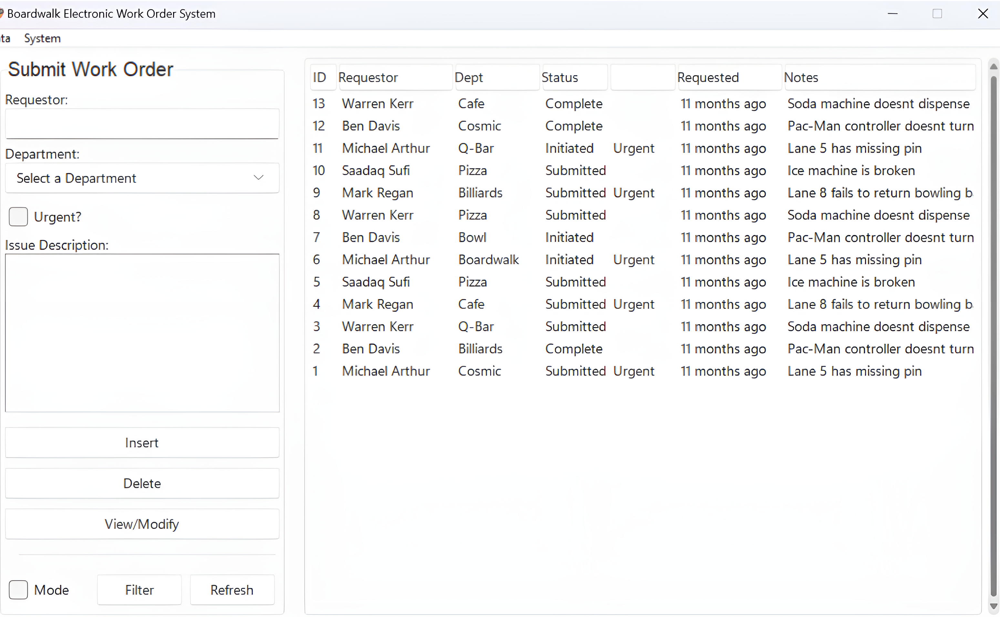
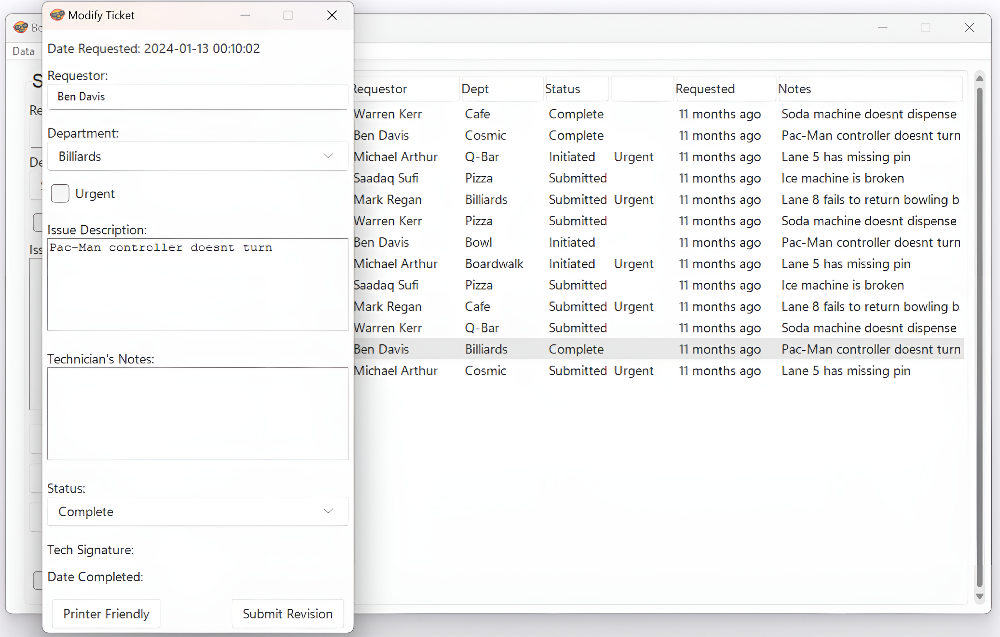
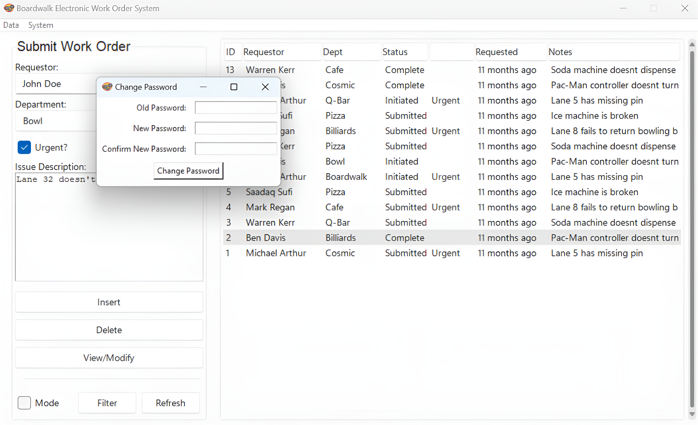
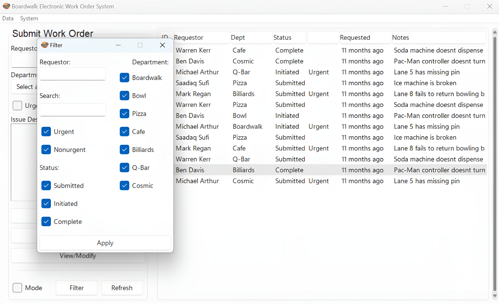
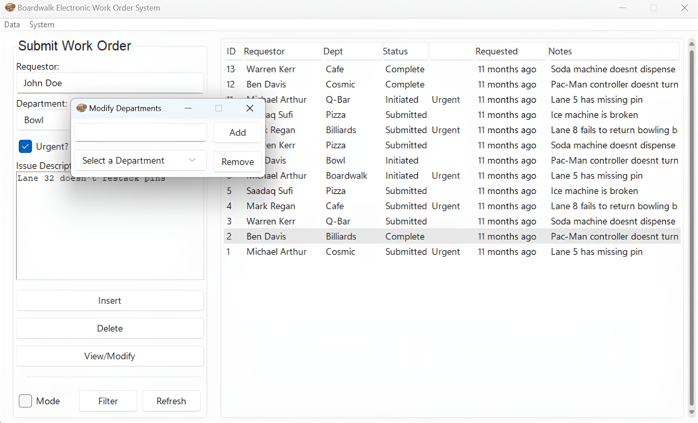

# 🎡 Boardwalk Electronic Work Order System (EWOS)

## 🛠 Overview
The **Boardwalk EWOS** is a desktop application developed to digitize and streamline the maintenance work order system at an amusement center. Designed with simplicity and efficiency in mind, it replaces outdated paper forms with a robust ticketing system that enhances tracking, communication, and resolution speed.



---

## ✨ Key Features
- 🔧 Submit and manage maintenance work orders through a clean UI
- ⚠️ Flag **Urgent** issues with a single click
- 📋 Track **status**, **notes**, and **technician updates**
- 🧑‍💻 Multi-role support with tiered access control
- 💾 Backend data persistence using MySQL
- 📌 Filter tickets by department, urgency, and status
- 🔍 View/Modify ticket details in popup modals
- 🌙 Light and Dark Mode toggle


---

## 🧑‍💻 Contributors

| Section                   | Contributor     | Notes                                               |
|---------------------------|-----------------|-----------------------------------------------------|
| Overview & Database       | Jacob Davis     | Backend setup with MySQL                            |
| Architecture & Components | Warren Kerr     | Contributed across all modules                      |
| Tech Stack & Filters      | Mark Regan      | Implemented filtering and maintained tech stack     |
| UI/UX Enhancements        | Saadaq Sufi     | Developed popups and polished user experience       |
| Security & Final Polish   | Michael Arthur  | Added security checks and application refinement    |

---

## ⚙️ Technology Stack

- Python 3.13
- Tkinter (GUI)
- MySQL (Database)
- `mysql-connector-python` library
- `humanize` library

---

## 🚀 Getting Started

### Prerequisites
Ensure the following are installed:

```bash
Python 3.13+
MySQL Server
pip install mysql-connector-python
pip install humanize
```

### Setup Steps

1. **Configure MySQL Credentials**  
   Create a `connect.cnf` file in the `database/` directory:

   ```
   [client]
   user = your_mysql_username
   password = your_mysql_password
   host = 127.0.0.1
   database = WORKORDERS
   ```

2. **Create the Database**

   ```bash
   python database/create_mysql_db.py
   ```

3. **Create Tables and Insert Initial Data**

   ```bash
   python database/create_mysql_table.py
   ```

4. **Run the Application**

   ```bash
   python main.py
   ```

---

## 📁 Project Structure

```
/Boardwalk-Electronic-Work-Order-System-EWOS-
├── /auth
│   └── authentication.py
|
├── /database
│   ├── connect.cnf
│   ├── create_mysql_db.py
│   ├── create_mysql_table.py
│   └── database_connector.py
|
├── /images
│   ├── EWOS_1.png
│   ├── EWOS_2.png
│   ├── EWOS_3.png
│   ├── EWOS_4.png
│   ├── EWOS_5.png
│   ├── EWOS_6.png
│   └── EWOS_7.png
|
├── /ui
│   ├── filterpop.py
│   ├── popup.py
│   └── /themes
│       └── /sv_ttk
|
├── .gitignore
├── bw_guy.ico
├── CREDITS.md
├── LICENSE
├── main.py
├── README.md
└── requirements.txt


```

---

## 📸 Interface Preview






---

## 📝 License
This project is licensed under the **MIT License** - see the LICENSE file for details.
